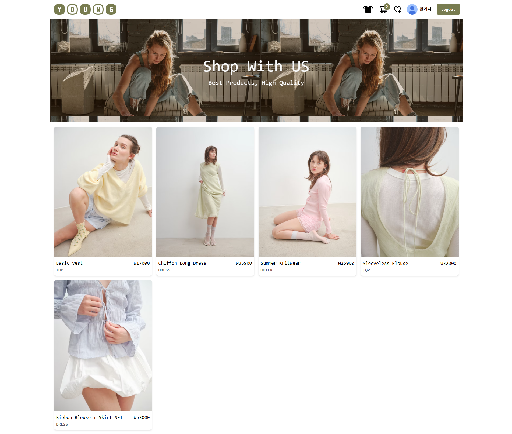
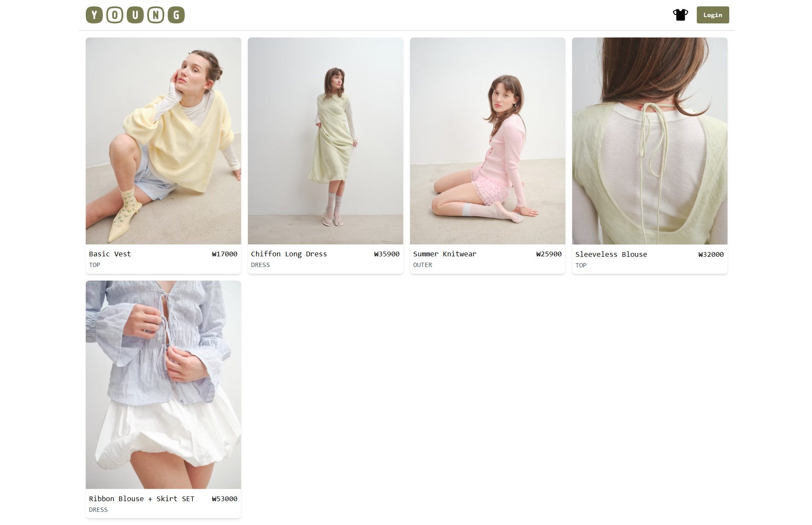
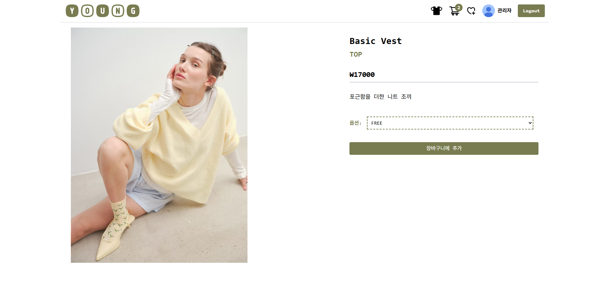
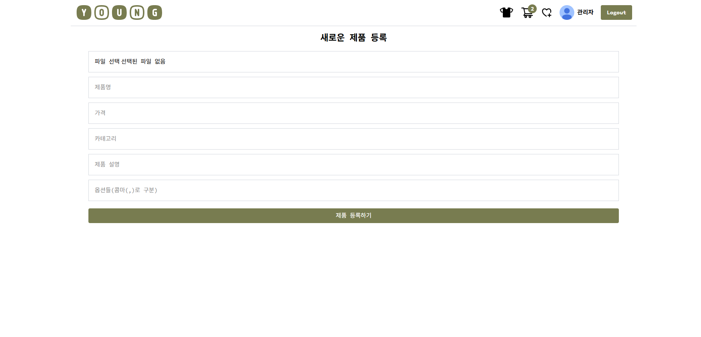
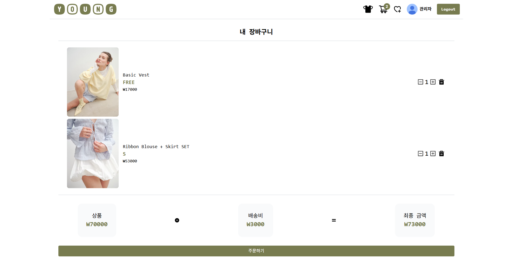

# YoungStyle
- **Firebase**와 **Cloudinary**를 활용하여 구현한 반응형 쇼핑몰 웹사이트입니다.
  

## 🖥 화면 구성

 
<h3 style="display:inline; margin-left:4px">1️⃣ 메인 화면</h3>

 <h4>로그인</h4>
 
 <h4>로그아웃</h4>
 

 
<h3 style="display:inline; margin-left:4px">2️⃣ 제품 목록 화면</h3>

 

 
<h3 style="display:inline; margin-left:4px">3️⃣ 제품 상세 화면</h3>

 

 
<h3 style="display:inline; margin-left:4px">4️⃣ 제품 등록 화면</h3>

 

 
<h3 style="display:inline; margin-left:4px">5️⃣ 장바구니 화면</h3>

 

